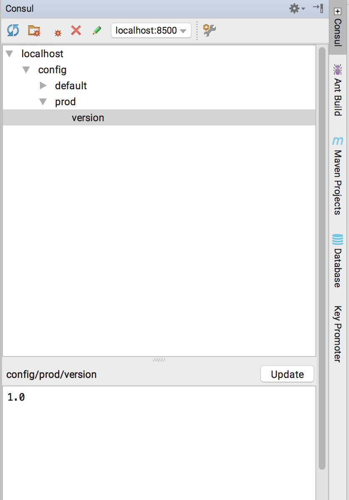

# Consul K/V Store plugin for IntelliJ IDEA

An IntelliJ IDEA plugin for Consul Key/Value store.

## Supported features

*   Browse Consul K/V repository. Add, edit and remove entries and folders.
*   Define multiple Consul instances and easily switch between them
*   Export the contents of a Consul folder to the `.properties` file
*   Paste values like `version=1` directly from the Clipboard to the Consul tree
*   Copy values to the Clipboard in the `=`-delimited format

## Installing

1. Download the [latest release](https://github.com/novotnyr/consul-intellij-plugin/releases) as a ZIP file.
2. From *IntelliJ* settings, drill down to *Plugins* and install via **Install Plug-in From disk** button.

## Screenshots

